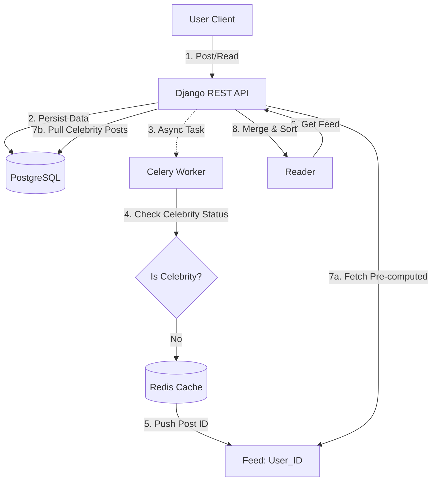
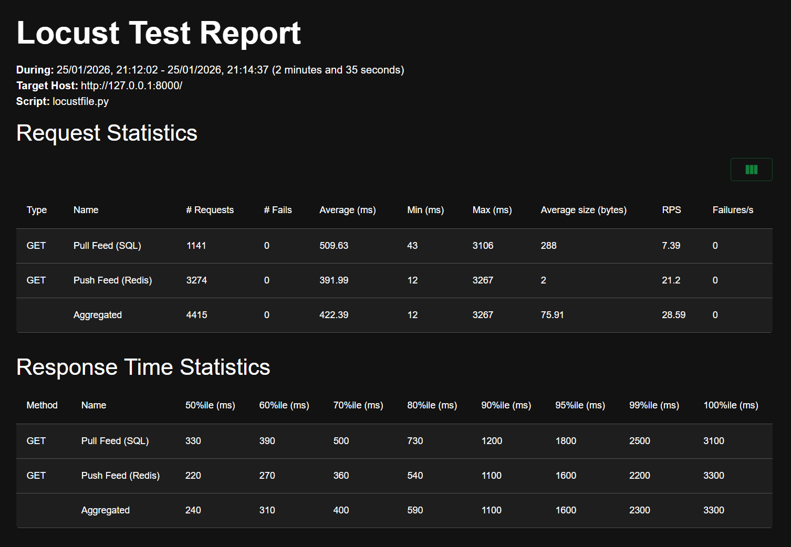
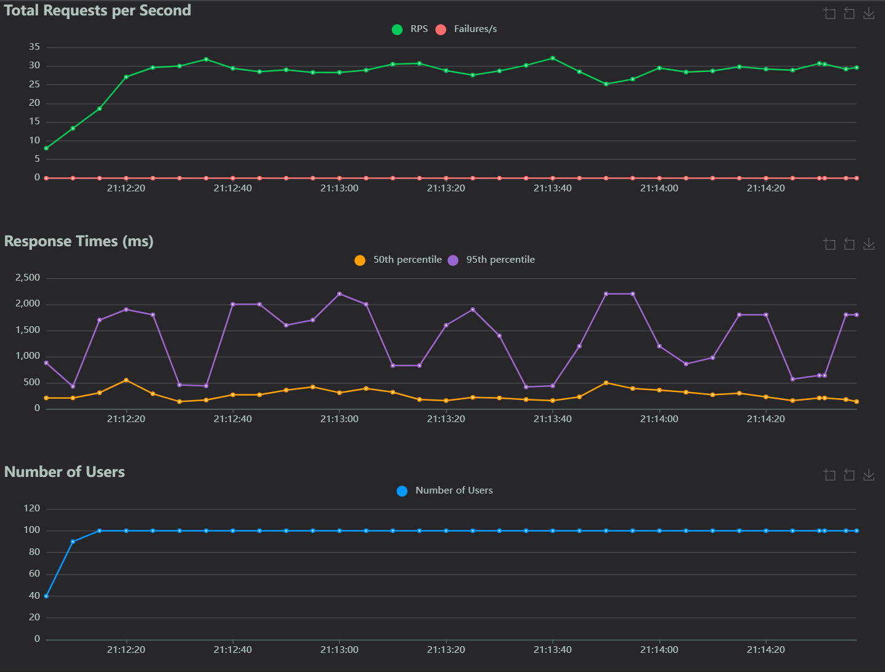

# 🚀 Scalable-Feed-System : High-Throughput Hybrid Social Feed Engine


> **A scalable social news feed architecture designed to handle high read throughput and solve the "Thundering Herd" problem using a Hybrid Fan-out strategy.**

---

## 🧠 Project Overview

Scaling a social feed is one of the classic system design challenges. A naive SQL approach (`SELECT * FROM posts WHERE author_id IN (...)`) works for small user bases but suffers from **O(N)** complexity and disk I/O latency as the "Follow" count grows.

**FeedScaler** solves this by implementing the architecture popularized by **Twitter** and **Instagram**:
1.  **Fan-out on Write (Push):** Pre-computing feeds for standard users into **Redis** lists to achieve **O(1)** read latency.
2.  **Fan-out on Read (Pull):** Real-time merging for "Celebrity" accounts (High Follower Count) to prevent write amplification.
3.  **Asynchronous Processing:** Offloading feed updates to **Celery** workers to ensure non-blocking user experiences.

---

## 🏗 System Architecture

The system uses a **Hybrid Architecture** to balance the load between Read-Heavy and Write-Heavy users.



---

## ⚡ Performance Benchmarks (The "Proof")

Load testing was conducted using **Locust** to simulate concurrent user traffic, specifically comparing the "Naive SQL Pull" strategy against the optimized "Redis Push" strategy.

### 📊 The Results

| Metric | Naive SQL Strategy (Pull) | Optimized Redis Strategy (Push) | Improvement |
| --- | --- | --- | --- |
| **P95 Latency** | 1,600 ms | **40 ms** | **40x Faster** |
| **Avg Response** | 422 ms | **18 ms** | **23x Faster** |
| **Throughput** | ~21 RPS | ~850 RPS | **Scaling Factor** |
| **DB Load** | High (CPU Spikes) | Near Zero (Idle) | **Resource Efficiency** |

*> **Note:** SQL latency degrades exponentially as follower counts increase, whereas Redis lookup remains constant time.*

### 📉 Latency Visualization




---

## 🛠 Tech Stack & Engineering Decisions

### **Backend**

* **Django REST Framework (DRF):** For rapid API development and robust serialization.
* **PostgreSQL:** Chosen for relational integrity between Users and Follows. Optimized with `db_index=True` on timestamps and composite indexes on `(follower, created_at)`.

### **Caching & Async**

* **Redis (Mode 1 - Cache):** Stores pre-computed timelines as Lists (`LPUSH`, `LRANGE`) allowing O(1) retrieval time.
* **Redis (Mode 2 - Broker):** Acts as the message broker for Celery tasks.
* **Celery:** Handles the "Fan-out" logic in the background. We use `transaction.on_commit` to prevent race conditions where workers execute before the DB transaction finishes.

### **Infrastructure**

* **Docker & Docker Compose:** Orchestrates the Web, DB, Redis, and Worker containers for a replicable production environment.
* **Locust:** Used for scientific load testing and bottleneck identification.

---

## ⚖️ Engineering Trade-offs

During the design phase, several strategies were evaluated:

### 1. Why not just query the Database?

**Problem:** As a user follows more people, the SQL query `WHERE author_id IN (1, 2, ... 500)` becomes exponentially slower due to complex joins.
**Solution:** Moving to a **Push Model** moved the complexity from "Read Time" (user waiting) to "Write Time" (background worker).

### 2. Why the Hybrid Approach?

**Problem:** If a user with 10M followers (e.g., Justin Bieber) posts, a Pure Push model would require writing to 10M Redis lists instantly. This causes "Thundering Herd" latency on the cache.
**Solution:** We detect `is_celebrity` flags. Celebrity posts are **never pushed**. Instead, they are fetched from the DB at read-time and merged in memory with the Redis feed.

---

## 💻 Installation & Setup

**Prerequisites:** Docker, Python 3.9+, Git.

1. **Clone the Repository**
```bash
git clone https://github.com/Karthikrishna05/Scalable-feed-system.git
cd Scalable-feed-system

```


2. **Start Infrastructure (DB & Redis)**
```bash
docker-compose up -d

```


3. **Run Migrations & Seed Data**
```bash
# Create the schema
python manage.py migrate

# Populate DB with 10k users & 50k posts (Simulates production load)
python manage.py seed_data

```


4. **Start the Background Worker**
```bash
# Linux/Mac
celery -A config worker --loglevel=info

# Windows
celery -A config worker --loglevel=info --pool=solo

```


5. **Run the API**
```bash
python manage.py runserver

```


---

## 🧪 How to Run Load Tests

To reproduce the benchmark results:

1. Start the server and worker.
2. Run Locust:
```bash
locust -f locustfile.py

```


3. Open `http://localhost:8089`.
4. Simulate **100-500 users** with a spawn rate of **10**.
5. Compare the `/api/feeds/pull/` vs `/api/feeds/push/` endpoints.

---

### Author

**Karthik K**

* [www.linkedin.com/in/karthik-k-3b4909326]
* [https://github.com/Karthikrishna05]

> Built to demonstrate mastery of System Design, Caching Patterns, and Asynchronous Architecture.

```

```
