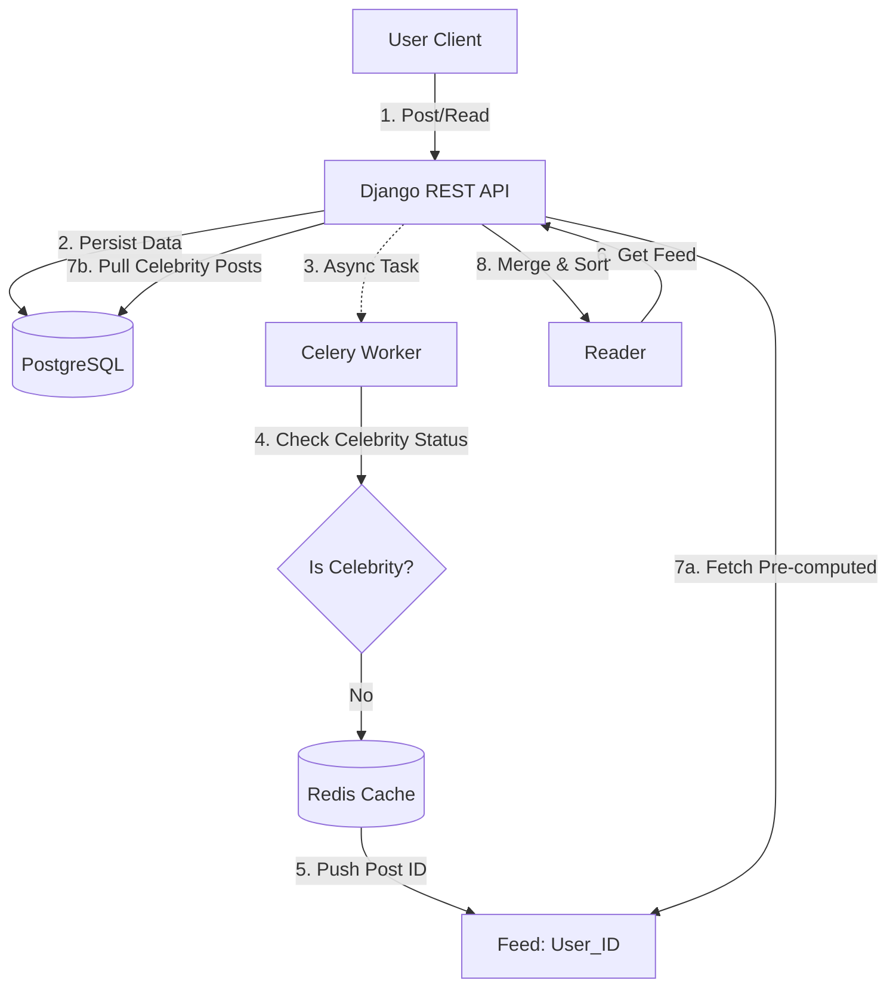
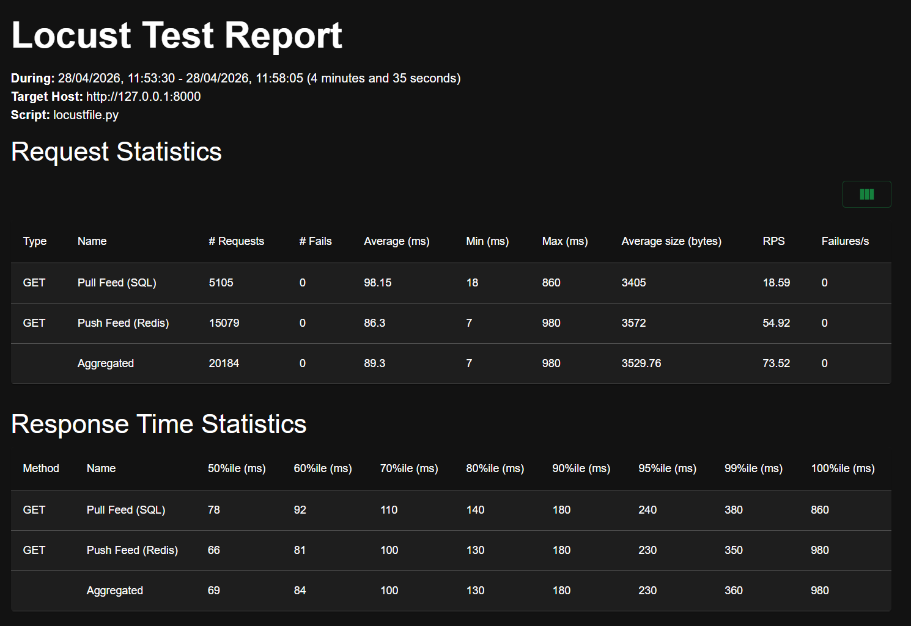
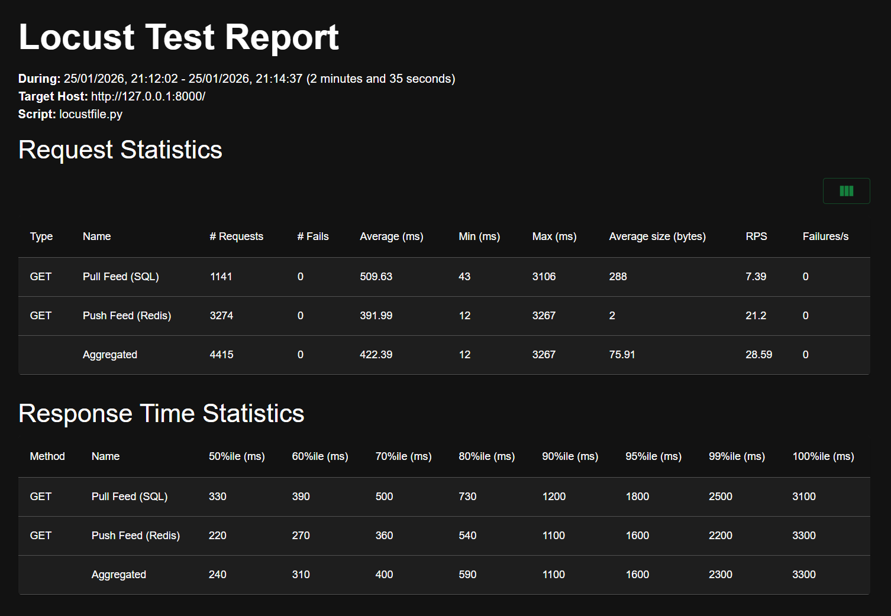

# 🚀 Scalable Feed System


> A scalable social feed architecture that implements and benchmarks three feed delivery strategies used by platforms like Twitter/X, Instagram, and Facebook — solving the "Thundering Herd" problem using a Hybrid Fan-out strategy.

---

## System Architecture


```mermaid
graph TD
    User[User Client] -->|1. Post/Read| API[Django REST API]
    API -->|2. Persist Data| DB[(PostgreSQL)]
    
    %% Async Write Path
    API -.->|3. Async Task| Celery[Celery Worker]
    Celery -->|4. Check Celebrity Status| Logic{Is Celebrity?}
    
    %% Push Flow - Normal Users
    Logic -- No --> Redis[(Redis Cache)]
    Redis -->|5. Push Post ID| FeedList[Feed: User_ID]
    
    %% Hybrid Read Path
    User2[Reader] -->|6. Get Feed| API
    API -->|7a. Fetch Pre-computed| FeedList
    API -->|7b. Pull Celebrity Posts| DB
    API -->|8. Merge & Sort| User2
```

---

## Feed Strategies

### 1. Pull Model (`/api/feeds/pull/`)
On every request, queries PostgreSQL to:
1. Find who the user follows (`Follow` table)
2. Fetch recent posts from those users (`Post` table)
3. Sort by `created_at` (expensive JOIN + ORDER BY)

**Pros:** Always fresh, simple to implement  
**Cons:** Slow under load — every request does a full SQL query

### 2. Push Model — Fan-out-on-write (`/api/feeds/push/`)
When a post is created, a Celery background task pushes the `post_id` into each follower's Redis list (`feed:{user_id}`). On read:
1. Fetches post IDs from Redis (`LRANGE`)
2. Batch-fetches post objects from PostgreSQL
3. Returns them in the pre-computed order

**Pros:** Reads are extremely fast (Redis → batch SQL)  
**Cons:** Write amplification (1 post → N followers × 1 Redis write)

### 3. Hybrid Model (`/api/feeds/hybrid/`)
Combines both approaches:
- Regular users get **push** feeds (pre-computed in Redis)
- Celebrity posts are **pulled** on-demand (avoids fan-out to millions)

---

## Tech Stack

| Component    | Technology           |
|-------------|---------------------|
| API Server  | Django 5.2 + DRF    |
| Database    | PostgreSQL 17       |
| Cache/Queue | Redis 7             |
| Task Queue  | Celery              |
| WSGI Server | Waitress            |
| Load Testing| Locust              |
| Containers  | Docker Compose      |

---

## Engineering Trade-offs

### Why not just query the database?

**Problem:** As a user follows more people, `WHERE author_id IN (1, 2, ... 500)` becomes exponentially slower due to complex joins.  
**Solution:** The **Push Model** moves complexity from read time (user waiting) to write time (background worker).

### Why the Hybrid approach?

**Problem:** If a user with 10M followers posts, a pure push model writes to 10M Redis lists — the "Thundering Herd" problem.  
**Solution:** Celebrity posts (`is_celebrity` flag) are never pushed. They're fetched from the DB at read time and merged in memory with the Redis feed.

---

## Benchmark Results

### Methodology

| Parameter | Value |
|-----------|-------|
| Environment | Local Docker Compose (single machine — PostgreSQL, Redis, Celery, Django share resources) |
| Server | Waitress (8 threads, connection-limit=500) |
| Django Settings | `DEBUG = False`, no debug middleware, `CONN_MAX_AGE = 60` |
| Redis State | Pre-warmed via `warm_redis` management command before every test run |
| Load Tool | Locust — task weighting: Push Feed `@task(3)`, Pull Feed `@task(1)` |
| Avg Response Size | Pull: 3,405 bytes / Push: 3,572 bytes (real feed data, not empty responses) |

> **Note:** All services share a single machine's CPU and memory, which inflates latency compared to a production multi-node deployment. Numbers reflect relative performance between strategies, not absolute throughput.

---

### Test 1 — 100 Concurrent Users (Spawn Rate: 10/s) ✅ Primary Benchmark



| Metric | Pull Feed (SQL) | Push Feed (Redis) | Δ |
|--------|----------------|-------------------|---|
| Total Requests | 5,105 | 15,079 | — |
| Failures | 0 (0%) | 0 (0%) | ✅ Stable |
| RPS | 18.59 | **54.92** | **3x throughput** |
| Avg Response (ms) | 98 | **86** | 12% faster |
| **P50 (ms)** | 78 | **66** | **15% faster** |
| P90 (ms) | 180 | 180 | Comparable |
| **P95 (ms)** | 240 | **230** | 4% faster |
| **P99 (ms)** | 380 | **350** | 8% faster |

**Takeaway:** The Redis push feed serves **3x the request volume** at **15% lower median latency** — demonstrating the throughput advantage of pre-computed feeds under concurrent load.

---

### Test 2 — 300 Concurrent Users (Spawn Rate: 30/s)

| Metric | Pull Feed (SQL) | Push Feed (Redis) |
|--------|----------------|-------------------|
| Total Requests | 3,031 | 9,271 |
| Failures | 0 (0%) | 0 (0%) |
| RPS | 18.94 | 57.94 |
| P50 (ms) | 1,900 | 1,900 |
| P95 (ms) | 4,000 | 4,100 |
| P99 (ms) | 5,200 | 37,000 |

**Observation — Server saturation:** RPS is unchanged from 100 users (57.94 vs 54.92), and both endpoints converge to the same p50 of 1,900ms. The bottleneck is the Waitress thread pool, not the application layer. With 8 threads saturated, all requests queue equally regardless of backend. The Redis p99 spike is a consequence of the 3:1 task weighting — Redis receives 3x more traffic, so its queue is proportionally longer under saturation.

**Resolution:** Deploying with `gunicorn --worker-class=gevent` on Linux would eliminate thread-pool saturation and restore the latency advantage at 300+ users.

---

### What Changed Between Initial and Final Benchmarks

The initial benchmark was **invalid** — diagnosed and fixed during development:



| Bug | Root Cause | Fix |
|-----|-----------|-----|
| Redis returning `[]` (2 bytes) | `bulk_create()` bypasses Django `post_save` signals → fan-out never triggered | Added explicit fan-out in `seed_data.py`; created `warm_redis` command |
| p99 of 55,000ms | `DEBUG = True` logged every SQL query in memory; `DebugToolbarMiddleware` overhead | Set `DEBUG = False`; removed debug toolbar |
| N+1 queries in pull feed | Missing `select_related('Author')` — 20 extra queries per request | Added `select_related('Author')` to queryset |

---

## Quick Start

**Prerequisites:** Docker, Python 3.9+, Git

### 1. Clone & Install
```bash
git clone https://github.com/Karthikrishna05/Scalable-feed-system.git
cd Scalable-feed-system
pip install -r requirements.txt
```

### 2. Start Infrastructure
```bash
docker compose up -d
```

### 3. Migrate & Seed
```bash
python manage.py migrate
python manage.py seed_data
```
Creates 1,000 users, 500 follow relationships, and 10,000 posts. Also queues Celery fan-out tasks to populate Redis.

### 4. Start Celery Worker
```bash
# Linux/Mac
celery -A config worker -l info

# Windows
celery -A config worker -l info --pool=solo
```

### 5. Warm Redis (if needed)
If Redis is empty after a restart:
```bash
python manage.py warm_redis --limit 5000
```
Wait 30-60 seconds for Celery to process.

### 6. Verify Redis
```bash
redis-cli -n 1 LLEN feed:1   # Should be > 0
```

### 7. Start the Server

For development:
```bash
python manage.py runserver
```

For load testing (use Waitress — Django's dev server is single-threaded):
```bash
waitress-serve --threads=8 --connection-limit=500 --channel-timeout=30 --port=8000 config.wsgi:application
```

### 8. Run Load Tests
```bash
locust -f locustfile.py --host=http://127.0.0.1:8000 --users 100 --spawn-rate 10
```
Open http://localhost:8089 to see the Locust dashboard.

---

## Project Structure

```
├── config/                         # Django project settings
│   ├── settings.py                 # DB, Redis, Celery config
│   ├── celery.py                   # Celery app definition
│   └── urls.py                     # Root URL routing
├── core/                           # Core data models
│   ├── models.py                   # User, Post, Follow models
│   ├── signals.py                  # post_save → fan_out trigger
│   └── management/commands/
│       ├── seed_data.py            # Generate fake data
│       └── warm_redis.py           # Populate Redis from DB
├── feeds/                          # Feed delivery logic
│   ├── views.py                    # Pull, Push, Hybrid endpoints
│   ├── tasks.py                    # Celery fan-out task
│   ├── serializer.py               # DRF serializers
│   └── urls.py                     # Feed URL routing
├── docker-compose.yml              # PostgreSQL + Redis containers
├── locustfile.py                   # Load testing script
└── requirements.txt                # Python dependencies
```

## Known Limitations

- **No authentication in benchmarks:** Views fall back to `User.objects.first()` for anonymous requests. Production benchmarks should use token-based auth with randomised user IDs.
- **Single-machine Docker:** All services share one machine's CPU/memory, inflating absolute latency. The relative comparison between strategies remains valid.
- **Thread-pool ceiling at 300 users:** With 8 Waitress threads, the server saturates at ~57 RPS regardless of backend. Production deployment with `gunicorn --worker-class=gevent` would sustain the Redis advantage at higher concurrency.
- **Celebrity flag unused in seed data:** `is_celebrity` exists but `seed_data` doesn't set it, so the hybrid feed's celebrity-pull path isn't exercised.
- **Write amplification not benchmarked:** Fan-out cost (1 post → N Redis writes) is not measured in the Locust script.

---

### Author

**Karthik K**
- [LinkedIn](https://www.linkedin.com/in/karthik-k-3b4909326)
- [GitHub](https://github.com/Karthikrishna05)

## License

MIT
