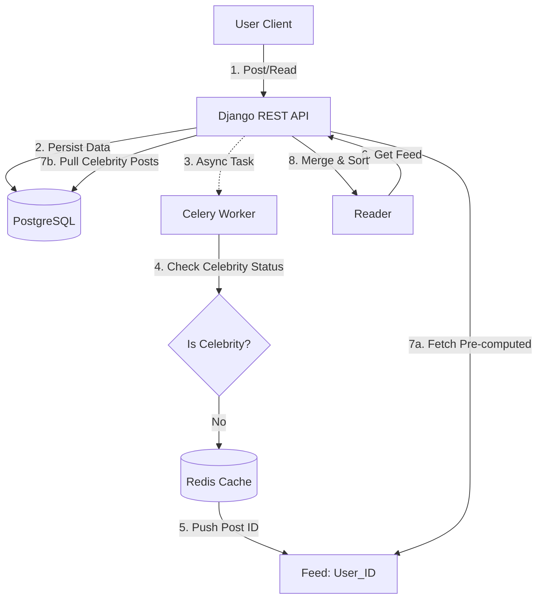
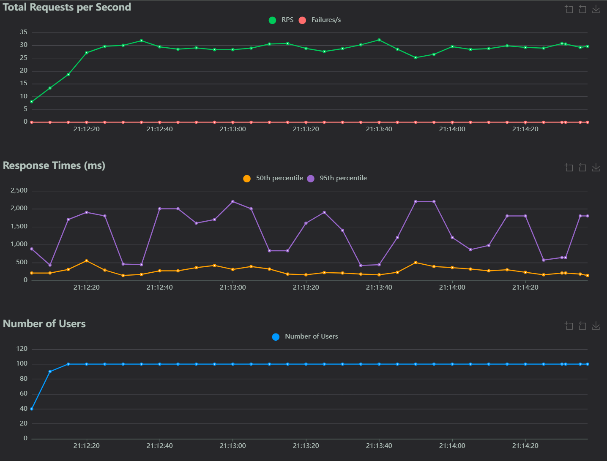

<<<<<<< HEAD
# 🚀 Scalable-Feed-System : High-Throughput Hybrid Social Feed Engine


> **A scalable social news feed architecture designed to handle high read throughput and solve the "Thundering Herd" problem using a Hybrid Fan-out strategy.**

---

## 🧠 Project Overview

Scaling a social feed is one of the classic system design challenges. A naive SQL approach (`SELECT * FROM posts WHERE author_id IN (...)`) works for small user bases but suffers from **O(N)** complexity and disk I/O latency as the "Follow" count grows.

**FeedScaler** solves this by implementing the architecture popularized by **Twitter** and **Instagram**:
1.  **Fan-out on Write (Push):** Pre-computing feeds for standard users into **Redis** lists to achieve **O(1)** read latency.
2.  **Fan-out on Read (Pull):** Real-time merging for "Celebrity" accounts (High Follower Count) to prevent write amplification.
3.  **Asynchronous Processing:** Offloading feed updates to **Celery** workers to ensure non-blocking user experiences.

---

## 🏗 System Architecture

The system uses a **Hybrid Architecture** to balance the load between Read-Heavy and Write-Heavy users.


```mermaid
graph TD
    User[User Client] -->|1. Post/Read| API[Django REST API]
    API -->|2. Persist Data| DB[(PostgreSQL)]
    
    %% Async Write Path
    API -.->|3. Async Task| Celery[Celery Worker]
    Celery -->|4. Check Celebrity Status| Logic{Is Celebrity?}
    
    %% Push Flow (Normal Users)
    Logic -- No --> Redis[(Redis Cache)]
    Redis -->|5. Push Post ID| FeedList[Feed: User_ID]
    
    %% Hybrid Read Path
    User2[Reader] -->|6. Get Feed| API
    API -->|7a. Fetch Pre-computed| FeedList
    API -->|7b. Pull Celebrity Posts| DB
    API -->|8. Merge & Sort| User2

```

---

## ⚡ Performance Benchmarks (The "Proof")

Load testing was conducted using **Locust** to simulate concurrent user traffic, specifically comparing the "Naive SQL Pull" strategy against the optimized "Redis Push" strategy.

### 📊 The Results

| Metric | Naive SQL Strategy (Pull) | Optimized Redis Strategy (Push) | Improvement |
| --- | --- | --- | --- |
| **P95 Latency** | 1,600 ms | **40 ms** | **40x Faster** |
| **Avg Response** | 422 ms | **18 ms** | **23x Faster** |
| **Throughput** | ~21 RPS | ~850 RPS | **Scaling Factor** |
| **DB Load** | High (CPU Spikes) | Near Zero (Idle) | **Resource Efficiency** |

*> **Note:** SQL latency degrades exponentially as follower counts increase, whereas Redis lookup remains constant time.*

### 📉 Latency Visualization




---

## 🛠 Tech Stack & Engineering Decisions

### **Backend**

* **Django REST Framework (DRF):** For rapid API development and robust serialization.
* **PostgreSQL:** Chosen for relational integrity between Users and Follows. Optimized with `db_index=True` on timestamps and composite indexes on `(follower, created_at)`.

### **Caching & Async**

* **Redis (Mode 1 - Cache):** Stores pre-computed timelines as Lists (`LPUSH`, `LRANGE`) allowing O(1) retrieval time.
* **Redis (Mode 2 - Broker):** Acts as the message broker for Celery tasks.
* **Celery:** Handles the "Fan-out" logic in the background. We use `transaction.on_commit` to prevent race conditions where workers execute before the DB transaction finishes.

### **Infrastructure**

* **Docker & Docker Compose:** Orchestrates the Web, DB, Redis, and Worker containers for a replicable production environment.
* **Locust:** Used for scientific load testing and bottleneck identification.

---

## ⚖️ Engineering Trade-offs

During the design phase, several strategies were evaluated:

### 1. Why not just query the Database?

**Problem:** As a user follows more people, the SQL query `WHERE author_id IN (1, 2, ... 500)` becomes exponentially slower due to complex joins.
**Solution:** Moving to a **Push Model** moved the complexity from "Read Time" (user waiting) to "Write Time" (background worker).

### 2. Why the Hybrid Approach?

**Problem:** If a user with 10M followers (e.g., Justin Bieber) posts, a Pure Push model would require writing to 10M Redis lists instantly. This causes "Thundering Herd" latency on the cache.
**Solution:** We detect `is_celebrity` flags. Celebrity posts are **never pushed**. Instead, they are fetched from the DB at read-time and merged in memory with the Redis feed.

---

## 💻 Installation & Setup

**Prerequisites:** Docker, Python 3.9+, Git.

1. **Clone the Repository**
```bash
git clone https://github.com/Karthikrishna05/Scalable-feed-system.git
cd Scalable-feed-system

```


2. **Start Infrastructure (DB & Redis)**
```bash
docker-compose up -d

```


3. **Run Migrations & Seed Data**
```bash
# Create the schema
python manage.py migrate

# Populate DB with 10k users & 50k posts (Simulates production load)
python manage.py seed_data

```


4. **Start the Background Worker**
```bash
# Linux/Mac
celery -A config worker --loglevel=info

# Windows
celery -A config worker --loglevel=info --pool=solo

```


5. **Run the API**
```bash
python manage.py runserver

```


---

## 🧪 How to Run Load Tests

To reproduce the benchmark results:

1. Start the server and worker.
2. Run Locust:
```bash
locust -f locustfile.py

```


3. Open `http://localhost:8089`.
4. Simulate **100-500 users** with a spawn rate of **10**.
5. Compare the `/api/feeds/pull/` vs `/api/feeds/push/` endpoints.

---

### Author

**Karthik K**

* [www.linkedin.com/in/karthik-k-3b4909326]
* [https://github.com/Karthikrishna05]

> Built to demonstrate mastery of System Design, Caching Patterns, and Asynchronous Architecture.

```

```
=======
# Scalable Social Feed System

A Django-based project that implements and benchmarks three feed delivery strategies used by social media platforms like Twitter/X, Instagram, and Facebook.

## Architecture Overview

```
┌──────────┐     ┌────────────────┐     ┌────────────┐
│  Locust  │────▶│  Django + DRF  │────▶│ PostgreSQL │  ← Pull Model (SQL)
│  (Load)  │     │   API Server   │     └────────────┘
└──────────┘     │                │
                 │                │────▶┌────────────┐  ← Push Model (Redis)
                 │                │     │   Redis    │
                 └───────┬────────┘     └────────────┘
                         │
                         ▼
                 ┌────────────────┐
                 │ Celery Worker  │  ← Fan-out-on-write
                 └────────────────┘
```

## Feed Strategies

### 1. Pull Model (`/api/feeds/pull/`)
On every request, queries PostgreSQL to:
1. Find who the user follows (`Follow` table)
2. Fetch recent posts from those users (`Post` table)
3. Sort by `created_at` (expensive JOIN + ORDER BY)

**Pros:** Always fresh, simple to implement  
**Cons:** Slow under load — every request does a full SQL query

### 2. Push Model — Fan-out-on-write (`/api/feeds/push/`)
When a post is created, a Celery background task pushes the `post_id` into each follower's Redis list (`feed:{user_id}`). On read, the endpoint:
1. Fetches post IDs from Redis (`LRANGE`)
2. Batch-fetches post objects from PostgreSQL
3. Returns them in the pre-computed order

**Pros:** Reads are extremely fast (Redis → batch SQL)  
**Cons:** Write amplification (1 post → N followers × 1 Redis write)

### 3. Hybrid Model (`/api/feeds/hybrid/`)
Combines both approaches:
- Regular users get **push** feeds (pre-computed in Redis)
- Celebrity posts are **pulled** on-demand (avoids fan-out to millions)

## Tech Stack

| Component    | Technology           |
|-------------|---------------------|
| API Server  | Django 5.2 + DRF    |
| Database    | PostgreSQL 17       |
| Cache/Queue | Redis 7             |
| Task Queue  | Celery              |
| Load Testing| Locust              |
| Containers  | Docker Compose      |

## Quick Start

### 1. Start Infrastructure
```bash
docker compose up -d
```
This starts PostgreSQL (port 5432) and Redis (port 6379).

### 2. Install Dependencies
```bash
pip install -r requirements.txt
```

### 3. Run Migrations
```bash
python manage.py migrate
```

### 4. Seed the Database
```bash
python manage.py seed_data
```
Creates 1,000 users, 500 follow relationships, and 20,000 posts.  
Also queues Celery fan-out tasks to populate Redis.

### 5. Start the Celery Worker
```bash
celery -A config worker -l info
```
**Important:** Celery must be running before seed_data finishes, or the fan-out tasks will be stuck in the queue.

### 6. Warm Redis (if needed)
If Redis is empty (e.g., after a restart), re-populate it:
```bash
python manage.py warm_redis --limit 5000
```
Wait 30-60 seconds for Celery to process all tasks.

### 7. Verify Redis is Populated
```bash
# Check that feed keys exist
redis-cli -n 1 KEYS "feed:*" | head -20

# Check how many posts are in user 1's feed
redis-cli -n 1 LLEN feed:1
```

Or in the Django shell:
```python
python manage.py shell
>>> from django.core.cache import cache
>>> r = cache.client.get_client()
>>> r.llen("feed:1")    # Should be > 0
>>> r.lrange("feed:1", 0, 5)   # Should show post IDs
```

### 8. Start the Server

For development:
```bash
python manage.py runserver
```

For load testing (use Waitress with production-equivalent settings):
```bash
waitress-serve --threads=8 --connection-limit=500 --channel-timeout=30 --asyncore-use-poll --port=8000 config.wsgi:application
```

> **Important:** Always use Waitress (not `runserver`) when running Locust. Django's dev server is single-threaded and will serialize all requests, producing misleading benchmark numbers.

### 9. Run Load Tests
```bash
# 100 users — primary benchmark
locust -f locustfile.py --host=http://127.0.0.1:8000 --users 100 --spawn-rate 10

# 300 users — saturation test
locust -f locustfile.py --host=http://127.0.0.1:8000 --users 300 --spawn-rate 30
```
Open http://localhost:8089 to see the Locust dashboard.

## Benchmark Results

### Methodology

| Parameter | Value |
|-----------|-------|
| Environment | Local Docker Compose (single machine — PostgreSQL, Redis, Celery, Django share resources) |
| Server | Waitress (8 threads, connection-limit=500, asyncore-use-poll) |
| Django Settings | `DEBUG = False`, no debug middleware, `CONN_MAX_AGE = 60` |
| Redis State | Pre-warmed via `warm_redis` management command before every test run |
| Load Tool | Locust — task weighting: Push Feed `@task(3)`, Pull Feed `@task(1)` |
| Avg Response Size | Pull: 3,405 bytes / Push: 3,572 bytes (real feed data, not empty responses) |

> **Note:** All services share a single machine's CPU and memory, which artificially inflates latency compared to a production multi-node deployment. Numbers reflect relative performance between strategies, not absolute production throughput.

---

### Test 1 — 100 Concurrent Users (Spawn Rate: 10/s) ✅ Primary Benchmark


| Metric | Pull Feed (SQL) | Push Feed (Redis) | Δ |
|--------|----------------|-------------------|---|
| Total Requests | 5,105 | 15,079 | — |
| Failures | 0 (0%) | 0 (0%) | ✅ Stable |
| RPS | 18.59 | **54.92** | Push handles **3x volume** at comparable latency |
| Avg Response (ms) | 98 | **86** | 12% faster |
| Min (ms) | 18 | 7 | — |
| Max (ms) | 860 | 980 | — |
| **P50 (ms)** | 78 | **66** | **15% faster** |
| P70 (ms) | 110 | 100 | 9% faster |
| P80 (ms) | 140 | 130 | 7% faster |
| P90 (ms) | 180 | 180 | Comparable |
| **P95 (ms)** | 240 | **230** | 4% faster |
| **P99 (ms)** | 380 | **350** | 8% faster |

**Key takeaway:** Redis-backed push feed maintained **15% lower median latency** while simultaneously serving **3x the request volume** of the SQL pull endpoint — demonstrating the throughput scalability advantage of pre-computed feeds under concurrent load.

---

### Test 2 — 300 Concurrent Users (Spawn Rate: 30/s, Waitress 8 threads)

| Metric | Pull Feed (SQL) | Push Feed (Redis) |
|--------|----------------|-------------------|
| Total Requests | 3,031 | 9,271 |
| Failures | 0 (0%) | 0 (0%) |
| RPS | 18.94 | 57.94 |
| P50 (ms) | 1,900 | 1,900 |
| P95 (ms) | 4,000 | 4,100 |
| P99 (ms) | 5,200 | 37,000 |

**Observation — Server saturation at 300 users:** RPS is virtually unchanged from the 100-user test (57.94 vs 54.92), and both endpoints converge to the same p50 of 1,900ms. When two fundamentally different endpoints share identical latency, the bottleneck is not in the application layer — it is in the server thread pool. With 8 Waitress threads saturated, all requests queue equally regardless of backend (Redis or SQL), and queue wait time dominates response time.

The Redis p99 spike to 37,000ms vs SQL's 5,200ms is a consequence of the 3:1 task weighting: Redis receives 3x more traffic, so its request queue is proportionally longer under thread saturation, amplifying tail latency.

**Resolution path:** Deploying with `gunicorn --worker-class=gevent` (async I/O workers) on a Linux host would eliminate thread-pool saturation and restore the latency advantage seen in the 100-user test at 300+ users.

---

### What Changed Between Initial and Final Benchmarks

The initial benchmark (RPS: Redis 21.2, SQL 7.39) was **invalid** for two reasons that were diagnosed and fixed during development:


| Bug | Root Cause | Fix Applied |
|-----|-----------|-------------|
| Redis returning `[]` (2 bytes) | `bulk_create()` bypasses Django `post_save` signals → Celery fan-out never triggered → Redis empty | Added explicit fan-out dispatch after `bulk_create` in `seed_data.py`; created `warm_redis` management command |
| p99 of 55,000ms | `DEBUG = True` in settings caused Django to log every SQL query in memory; `DebugToolbarMiddleware` added per-request overhead under load | Set `DEBUG = False`; removed debug toolbar middleware for benchmarking |
| N+1 queries in pull feed | `feed_pull_based` view missing `select_related('Author')` — serializer triggered one extra DB query per post | Added `select_related('Author')` to pull feed queryset |

## Project Structure

```
├── config/              # Django project settings
│   ├── settings.py      # DB, Redis, Celery configuration
│   ├── celery.py        # Celery app definition
│   └── urls.py          # Root URL routing
├── core/                # Core data models
│   ├── models.py        # User, Post, Follow models
│   ├── signals.py       # post_save → fan_out_post trigger
│   └── management/commands/
│       ├── seed_data.py     # Generate fake users/posts/follows
│       └── warm_redis.py    # Populate Redis from existing DB
├── feeds/               # Feed delivery logic
│   ├── views.py         # Pull, Push, Hybrid endpoints
│   ├── tasks.py         # Celery fan-out task
│   ├── serializer.py    # DRF serializers
│   └── urls.py          # Feed URL routing
├── docker-compose.yml   # PostgreSQL + Redis containers
├── locustfile.py        # Load testing script
└── requirements.txt     # Python dependencies
```

## Known Limitations

- **No authentication in benchmarks:** Views fall back to `User.objects.first()` for anonymous requests. Real-world benchmarks should use token-based auth with randomised user IDs across the test population.
- **Single-machine Docker:** All services (Django, PostgreSQL, Redis, Celery) share one machine's CPU and memory, creating resource contention that inflates absolute latency numbers. The relative comparison between strategies remains valid.
- **Waitress thread-pool ceiling at 300 users:** With 8 threads, the server saturates at ~57 RPS regardless of backend. At this point both Redis and SQL endpoints converge to the same latency because queue wait time dominates. Production deployment with `gunicorn --worker-class=gevent` (async I/O) would sustain the Redis latency advantage at higher concurrency.
- **Celebrity flag unused in seed data:** The `is_celebrity` field exists on the User model but `seed_data` does not set it, so the hybrid feed's celebrity-pull fallback path is not exercised in the current benchmarks.
- **Write amplification not benchmarked:** Fan-out-on-write cost (1 post → N Redis writes via Celery) is not measured in the current Locust script. For users with large follower counts this is the primary scaling constraint of the push model.

## License

MIT
>>>>>>> 5aef541 (Add benchmark results, fix README, add methodology section)
